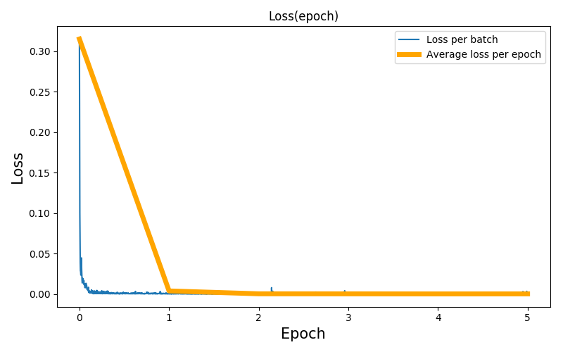

3D to 2D skeleton from depth camera with Deep Learning
==============================

This mini-project aims to estimate 2D skeleton data from 3D skeleton data. More specifically 2D skeleton data for IR frames from the kinect v2. Exact formulas exist, but we are too lazy to implement them ourselves. The motivation behind this work is that the [NTU RGB+D](http://rose1.ntu.edu.sg/datasets/actionrecognition.asp) dataset provides 2D IR skeleton data, while the [PKU MMD](http://www.icst.pku.edu.cn/struct/Projects/PKUMMD.html) action dataset does not. And we need them.

Project Organization
------------

    ├── LICENSE
    ├── Makefile           <- Makefile with commands like `make create_environment` or `make train`
    ├── README.md          <- The top-level README for developers using this project.
    ├── data
    │   ├── processed      <- The final, canonical data sets for modeling.
    │
    ├── models             <- Trained and serialized models, model predictions, or model summaries
    │
    ├── notebooks          <- Jupyter notebooks. Naming convention is a number (for ordering),
    │                         the creator's initials, and a short `-` delimited description, e.g.
    │                         `1.0-jqp-initial-data-exploration`.
    │
    ├── reports            <- Generated analysis as HTML, PDF, LaTeX, etc.
    │   └── figures        <- Generated graphics and figures to be used in reporting
    │
    ├── requirements.txt   <- The requirements file for reproducing the analysis environment, e.g.
    │                         generated with `pip freeze > requirements.txt`
    │
    ├── setup.py           <- makes project pip installable (pip install -e .) so src can be imported.

Getting started
------------
The first step to replicate our results is to download the project and create a virtual environment using the Makefile. 

The data used comes from the [NTU RGB+D dataset](http://rose1.ntu.edu.sg/datasets/actionrecognition.asp). Make sure to download the skeleton data and create two .h5 datasets with our code from our [GitHub repository](https://github.com/gnocchiflette/NTU-RGB-D). The two datasets are the "SKELETON" dataset and the "IR_SKELETON" dataset.

 1. Clone project

    `git clone https://github.com/gnocchiflette/3D-to-2D-skeleton-data-with-deep-learning.git `

2. Create virtual environment 

    `make create_environment `

3. Install requirements

    `make requirements` 

4. Place the two .h5 datasets in the *./data/processed/* folder. This folder already contains a text file containing the names of all the samples from the NTU RGB+D database called *samples_names.txt*.

5. That's it! All the code is inside the *./notebooks/* folder.  There is a single detailed notebook that acts as a main file. Feel free to rerun and modify our architecture. 

Results
------------
We split the entire NTU RGB+D dataset into a 50-50 train/test sets. We do not use a validation set. The reasoning behind this is as follows. The problem is simple enough. The MLP simply has to approximate an existing transformation (see Kinect v2 documentation). Plus, the training data is chosen in such a way that it is unlikely for the network to study the same point 2 times. 

In just 5 epochs, with a network weighing just 4kb, we are able to approximate 2D IR skeleton coordinates with an error in the 5-10 pixels range. We provide the model for each epoch in the *./models/* folder.

Better results can probably be obtained with a better use of the data and augmentation but the goal for this project was to be quickly operational. 

Below is the loss per epoch during training.

<small>Project based on the <a target="_blank" href="https://drivendata.github.io/cookiecutter-data-science/">cookiecutter data science project template</a>. #cookiecutterdatascience</small>

